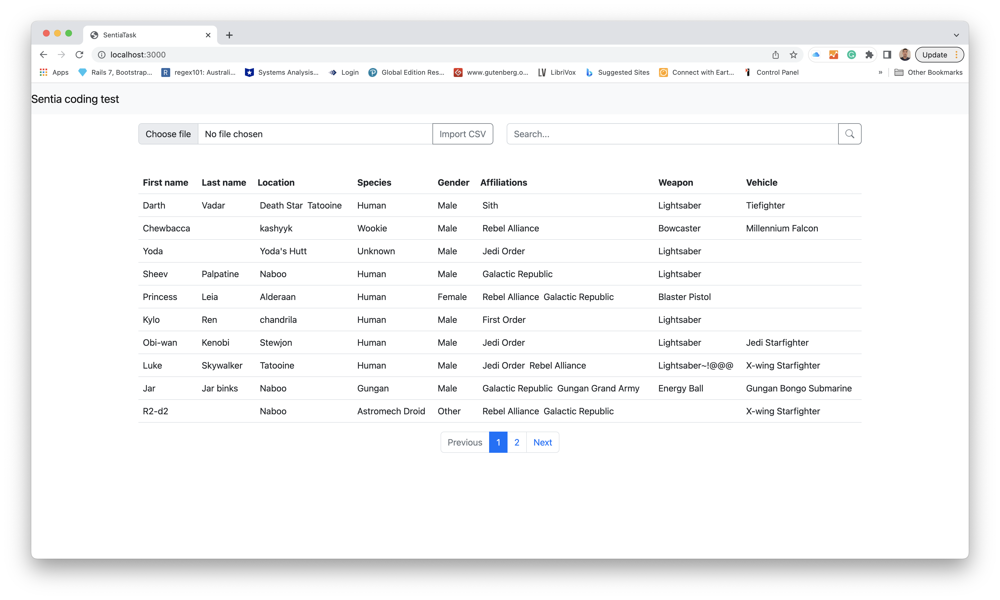

## Sentia coding test

This rails app is dedicated for Sentia code testing. The application consists of a backend and frontend.

I came up with patterns that I can rely upon such as:

- Use [JSON:API](https://jsonapi.org/) for my APIs
- Built the frontend design on [ReactJS](https://reactjs.org/) 

## 🛠 Skills
Ruby on Rails, ReactJS, Bootstrap, SCSS
## Installation
Please follow this instruction to setup this project locally.

- Ruby version 3.1.2p20
- Rails version 7.0.4

1. In your project directory

```bash
# Download and install
$ bundle install
$ npm install
```
2. Create database in your project

```bash
$rails db:create
$rails db:migrate
```
    
## Run the applicaiton locally
Using development environment you can the command below. It will run localhost at port 3000.
```bash
./bin/dev
```
or you can run rails server
```bash
rails server
```
## Screenshots




## API Reference

- Base URL: http://localhost:3000/
- Responses will be `application/json`

#### Get items

```http
  http://localhost:3000/api/v1/people
```

| Parameter | Type     | Description                |
| :-------- | :------- | :------------------------- |
| `page` | `Integer` | **Required**. Page number |
| `limit` | `Integer` | **Required**. Limit of the page |
| `q` | `String` | Search text |

#### Post item

```http
  http://localhost:3000/api/v1/people
```

| Parameter | Type     | Description                       |
| :-------- | :------- | :-------------------------------- |
| `first_name`      | `string` | **Required**. First name |
| `last_name`      | `string` | Last name |
| `location`      | `string` | **Required**. location. If you want to create more than 1 location, ";" should be divided by the symbol |
| `species`      | `string` | **Required**. species |
| `gender`      | `string` | **Required**. Gender. For example: m, male, female, f, and other |
| `affiliations`      | `string` | **Required**. affiliations. If you want to create more than 1 affiliation, ";" should be divided by the symbol  |
| `weapon`      | `string` | Weapon |
| `vehicle`      | `string` | Vehicle |


## Author

- [@Eddy Jaga](https://github.com/eddyjaga)

